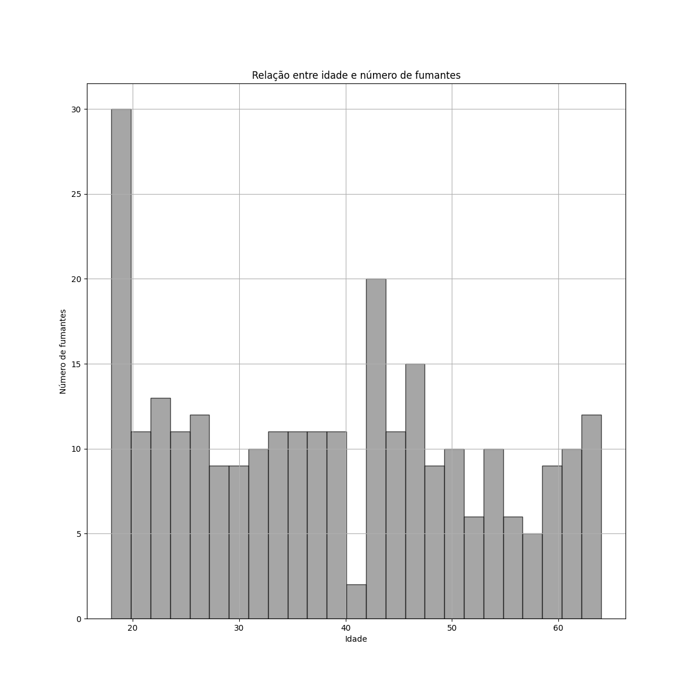

## Da estatística
Considerando a Fórmula de Sturges para 1338 dados e, arredondando o valor de K (11,39) para
o inteiro mais próximo, temos que o total de classes recomendado é igual à 11.

Como "64 - 18 = 46" e "46/11 = 4,18", vamos optar por considerar dez classes de tamanho 05
para evitar números não inteiros nas extremidades das classes.
     

